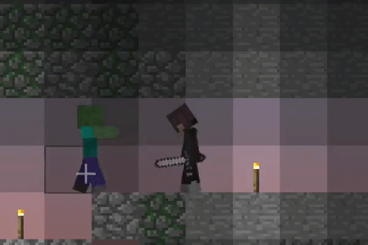
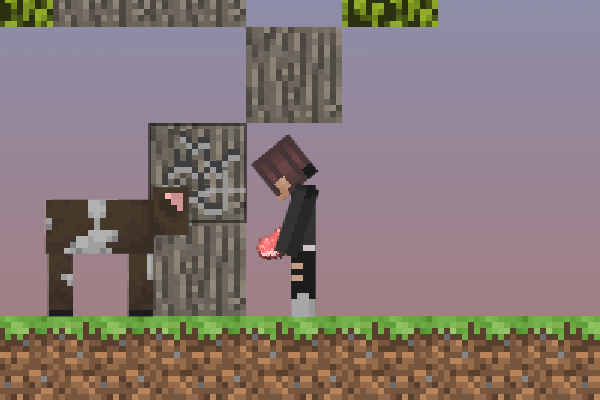
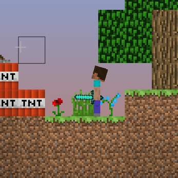
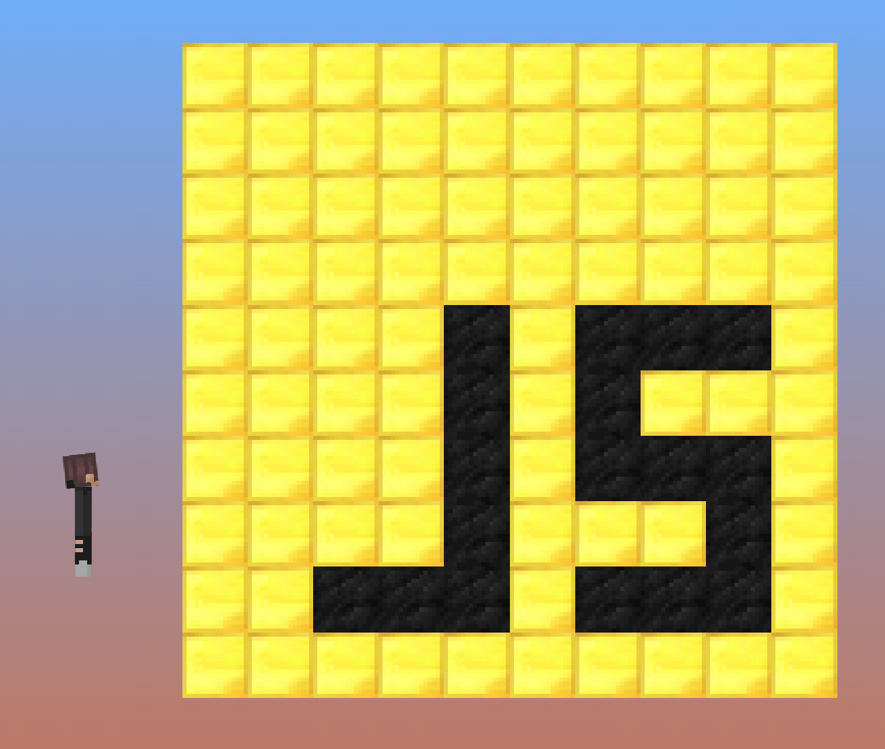

  

   

  
A 2D Minecraft fan game written entirely in JavaScript using no engines or frameworks!

  
<em>"The most complete 2D Minecraft fan game you can play in your browser!"</em>

  
<strong>Play here on Itch.io:</strong> <a href="https://plekiko.itch.io/minecraft-js">plekiko.itch.io/minecraft-js</a>

   

  

    
  

   

  

    
    
  

   

  

> [!IMPORTANT]
> This game is playable but still under development. Expect some minor issues. Please feel free to report any that you come across!

---

## Local Development

### Option 1 - Node.js
To get set up, run `npm install` in both the Client and Server directories.
You can then run `npx serve Client` in the root directory to host the client on `localhost:3000`. There is no hot-reloading, so any changes will require a page refresh.
To host a server, run `node server.js` from the Server directory. By default, this hosts on port 25565.

### Option 2 - Docker
If you wish to build the project with Docker, you can run:
`docker build -t minecraftjs .`. You can then run it with `docker run minecraftjs`, which will host the game on port 80 (simply `localhost`).
Please be advised that this is a static build and will not update when you modify the code unless you re-run the build command.

> [!NOTE]
> If you are using Docker on Linux in a non-root environment, you may need to use `--network=host` to avoid build and run errors.